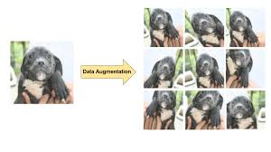
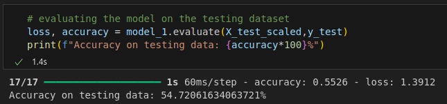
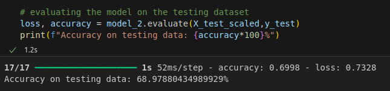

# Using Data Augmentation to reduce Overfitting of a CNN due to Limited Training Data 

An optimum deep neural network is expected to perform well on training as well as the testing dataset. A model that predicts or forecasts the outputs with considerable accuracy on training, as well as the testing data, is said to be a good fit model. However, over-fitting is a common issue while training a deep learning model. A model is said to overfit when it performs extremely well on the training data, but the performance on testing data is not as desired. 

The most common reason for the networks to overfit is the small size of training datasets or data scarcity. Hence, it is obvious that increasing the size of the dataset can improve the performance of the model. **Data Augmentation** is a popular technique used to prevent neural networks from overfitting. It is a process of generating new data points from the existing data points in order to expand the dataset. 

Some popular image augmentation techniques for creating more images include **changing their orientation, flipping, translation, changing the contrast, zooming in and zooming out**, and others. This process drastically increases the number of training samples, due to which the model is not able to overfit the dataset. With the aid of this process, multiple new images can be created using the limited number of available samples. Hence, data augmentation helps the neural network models to generalize well and increase the testing accuracy significantly. 

 
Source: Google Developers

This project demonstrates an example of an overfit model and how data augmentation can improve the generalizibility of an model and enhance the model performance even when a limited training data is available. 

A data augmentation layer which performs various operations like RandomFlip, RandomZoom, RandomRotation, RandomContrast, etc. is used to generate synthetic images from the available images. Applying the combination of these operations on the available images creates new images for training the model, hence effectively increasing the available training data. 

## Results
Implementing the data augmentation layer to create additional training data resulted into an increase in the model's ability to generalize and lead to an **increase in the testing accuracy from 54.72% to 68.97%**. 

 
 

## Author
Suyash Mali